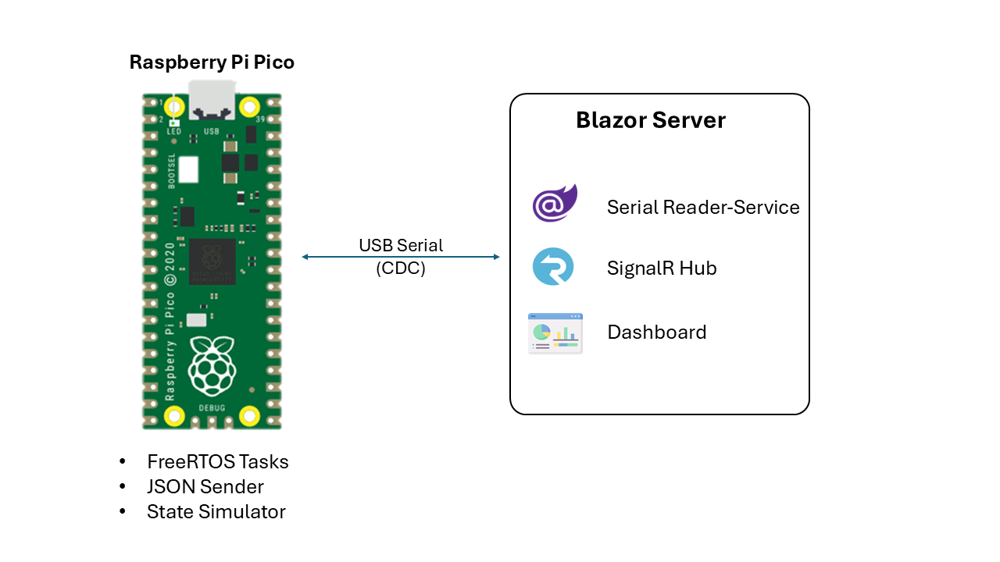

# 📊 FreeRTOS-Based Raspberry Pi Pico Monitoring Dashboard

This project demonstrates a real-time dashboard built with **Blazor Server** and a **Raspberry Pi Pico** running **FreeRTOS**, simulating internal device data (like temperature and status) and broadcasting it to a live web dashboard.

---

## 🚀 Features

- ⏱️ Real-time updates using **SignalR**
- 🔧 Simulated temperature/status via **FreeRTOS tasks**
- 📈 Live graphing using **Chart.js**
- 🔌 USB Serial (CDC) communication
- 🖥️ Web-based C# dashboard (ASP.NET Core Blazor Server)

---
## 🛠️ Folder Structure
```bash
PicoFreeRTOS-Dashboard/
├── 📁 blazor-dashboard/              # C# Blazor Server App
│   ├── Program.cs
│   ├── Pages/
│   ├── Models/
│   ├── Services/
│   ├── Hubs/
│   ├── wwwroot/js/
│   └── ... (.csproj, _Host.cshtml, etc.)
│
├── 📁 pico-freertos/                 # Raspberry Pi Pico FreeRTOS App
│   ├── main.c
│   ├── CMakeLists.txt
│   ├── freertos/                    
│   ├── include/
│   └── build/                       
│
├── 📁 docs/                          
│   ├── architecture.png
│   ├── dashboard-preview.png
│   └── serial-setup.png
│
├── .gitignore
├── README.md
└── LICENSE
```

---

## 🧠 System Overview



---

## 📦 Requirements

### Hardware:
- Raspberry Pi Pico (RP2040)
- USB cable (data)

### Software:
- Windows/Linux/Mac
- .NET SDK 7.0+
- Visual Studio / VS Code
- CMake + Ninja + pico-sdk
- [FreeRTOS](https://freertos.org)

---

## ⚙️ Setup Instructions

### 🔧 1. Build & Flash Pico (FreeRTOS)

```bash
cd pico-freertos
mkdir build && cd build
cmake ..
make
# Copy .uf2 to Pico USB storage
```
Ensure your Pico outputs JSON over USB Serial:
```bash
{ "device_id": "pico01", "status": "OK", "temp_sim": 33.4 }
```

---

## 🧾 `.gitignore` Examples

### `.gitignore`

```gitignore
# Pico build artifacts
pico-freertos/build/

# VS + .NET
bin/
obj/
*.user
*.vs/

# OS files
.DS_Store
Thumbs.db
```


